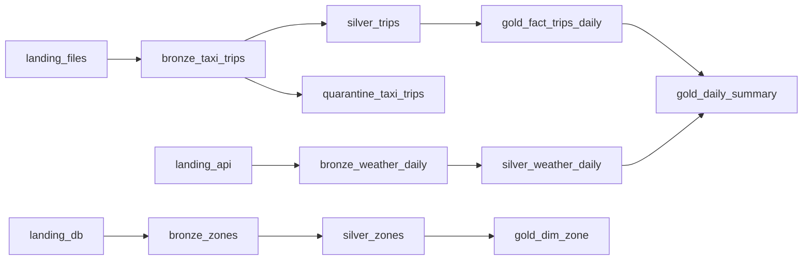

# Catalog, lineage & governance

- **Catalog registry:** `src/lakeforge/catalog.py` (`TABLES`) is the single list of tables, layers,
  descriptions and upstreams. The API, the access policy and the generated docs all use it.
- **Generated catalog:** the `catalog` stage (last task of each DAG run) writes
  `<LAKE_ROOT>/meta/catalog.md` (schemas read from Delta) and `lineage.mmd` (Mermaid graph).
- **Run lineage:** each stage writes `<LAKE_ROOT>/meta/lineage/<stage>__<batch>.json` with its inputs and outputs.
- **Access control:** `config/access_policy.yaml` maps roles to tables. Analysts see gold only;
  ML engineers also see selected silver; operators additionally see quarantine tables.

