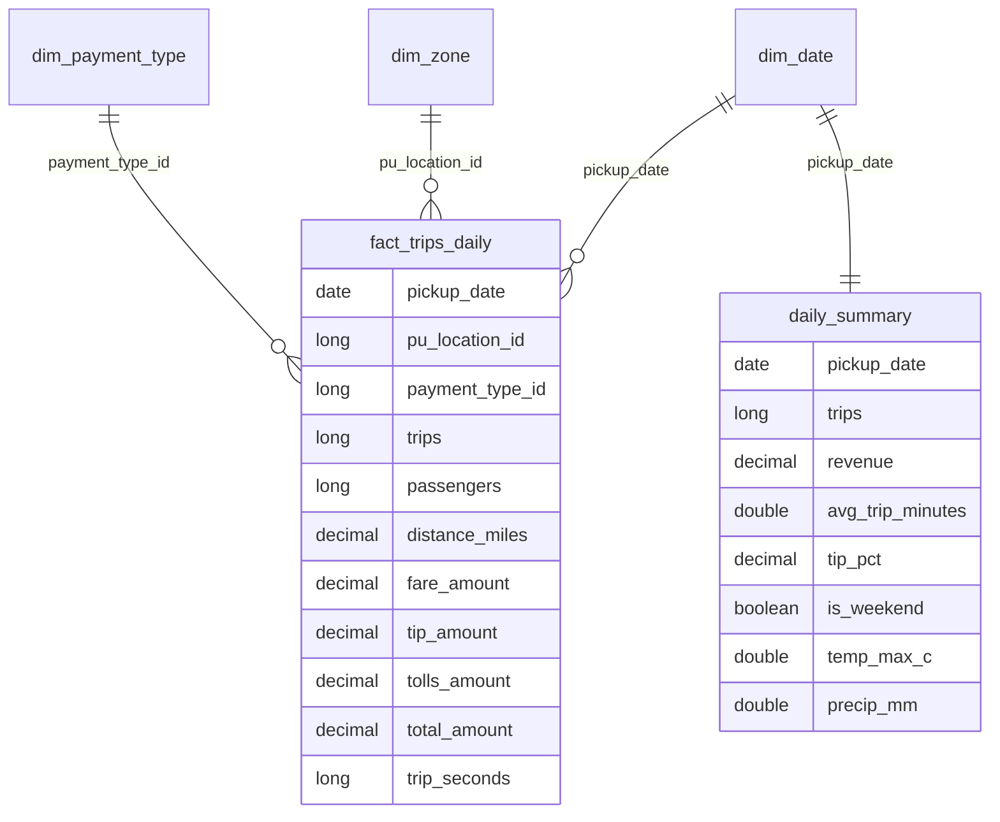

# Data model

| Table | Grain / key | Notes |
|---|---|---|
| `silver_trips` | `trip_id` = sha256(vendor, pickup, dropoff, PU, DO); partitioned by `pickup_date` | `trip_seconds`, `is_late_arrival`, `_batch_id`, `_ingested_at` |
| `silver_weather_daily` | `weather_date` | temp max/min (C), precipitation (mm) |
| `silver_zones` / `silver_payment_types` | business id | latest `updated_at` wins |
| `gold_fact_trips_daily` | pickup_date x pickup zone x payment type | additive measures |
| `gold_daily_summary` | pickup_date | KPIs + weather; ML feature table |
| `gold_dim_*` | surrogate = source id | dimensions rebuilt each run |
| `quarantine_*` | batch + row | `_failed_rules`, `_reasons`, `_record` (original row JSON) |

The full, generated, per-run column listing lives in `<LAKE_ROOT>/meta/catalog.md`.
