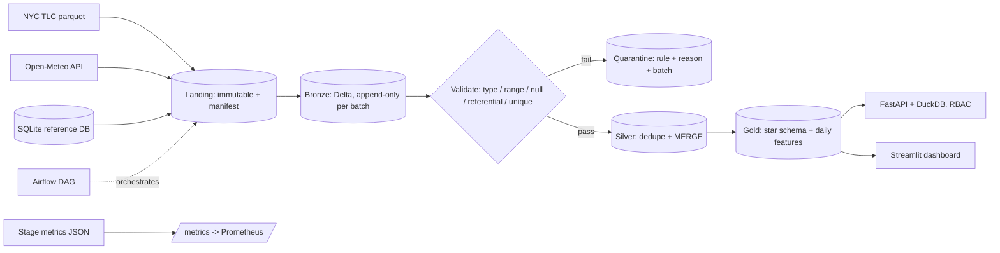

# Overview

## How each guarantee is achieved

| Guarantee | Mechanism |
|---|---|
| Immutable raw | Landing batches written once (atomic dir rename), SHA-256 manifest verified on every re-run; `ingested_at` comes from the manifest so re-runs are byte-stable |
| Idempotent bronze | `replaceWhere _batch_id = X` replaces exactly one batch |
| Idempotent silver | Deterministic dedupe (`row_number` with total ordering) then Delta `MERGE` on business key; update only when `s._batch_id >= t._batch_id` |
| Idempotent gold | Recompute the batch window (month + late window) from silver, `replaceWhere` on `pickup_date`; exact `decimal`/`long` aggregation avoids float drift |
| No lost records | Validation returns valid + quarantine; the stage fails if `in != valid + quarantined` |
| Late data | Window = `LATE_ARRIVAL_DAYS` before month start; accepted rows are flagged `is_late_arrival`, older rows are quarantined (`outside_late_window`) |
| Duplicates | Retained in bronze with batch lineage; removed deterministically in silver |
| Schema evolution | `schema_policy.py`: additive allowed (`mergeSchema`), safe widening cast, optional column missing tolerated, anything else raises `SchemaBreakingChange` and the stage fails (alert) |
| Governed access | API keys -> roles -> table allow-list; read-only SQL guard; DuckDB external access disabled |
| Observability | Per-stage JSON records -> `/metrics` (freshness, pass ratio, quarantined rows, duration, failures) |

## Source semantics

- **Files:** monthly TLC parquet; column names lower-cased (`Airport_fee` and `airport_fee` converge).
- **API:** one Open-Meteo call per month; the archive lags a few days, so run a month after it has ended.
- **Relational DB:** extracted as-of the end of the batch month (`updated_at < month_end`); stored per batch in bronze and merged by latest `updated_at` in silver.

## Known limits

Single-node Spark validates correctness and scaling trends, not cluster throughput. Dimensions are
type 1 (no history). Metrics/lineage JSON files are operational logs and are excluded from the
idempotency invariant.
