# Release v0.1.0

**Date:** October 2026

We are thrilled to announce the initial release of **LakeForge (v0.1.0)**!

This release establishes a robust, fully Dockerized Medallion Lakehouse architecture built on open-source tools (Apache
Spark, Delta Lake, Airflow, DuckDB, FastAPI). LakeForge guarantees idempotent processing, rigorous data quality
enforcement, and role-scoped analytics serving—all runnable on a single machine without complex host dependencies.

---

## 🌟 Executive Summary & Key Highlights

- **Idempotent Medallion Pipeline:** Automated ELT from raw Landing through Bronze, Silver, and Gold layers with strict
  schema enforcement and zero silent data drops.
- **Data Quality & Quarantine Engine:** Declarative YAML-based rules engine that filters bad rows into dedicated
  quarantine tables with associated rule-failure reasons.
- **Dual-Profile Orchestration (Airflow):** Choose between a lightweight SQLite-based standalone executor or a robust,
  production-grade PostgreSQL + LocalExecutor architecture.
- **RBAC Analytics API:** FastAPI and DuckDB powered endpoint providing role-based access control (RBAC) and SQL
  guardrails over Gold layer data.
- **Streamlit Dashboard:** Interactive visual analytics for taxi demand and weather correlation.
- **Full Observability Stack:** Integrated Prometheus and Grafana for live monitoring of pipeline freshness, stage
  durations, and data quality pass rates.
- **100% Docker-First:** No local Java, Spark, or Python environment setup required.

---

## 📸 Artifacts & Evidence

### 1. Architecture & Design

LakeForge is built on a clear, scalable design pattern capturing end-to-end data flow, dimensional modeling, and
rigorous governance.

**Pipeline Overview:**
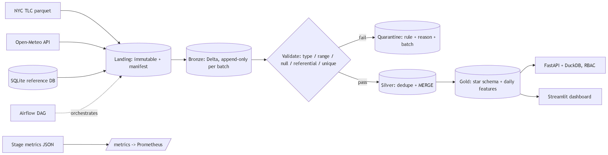

**Gold Layer Data Model (Star Schema):**
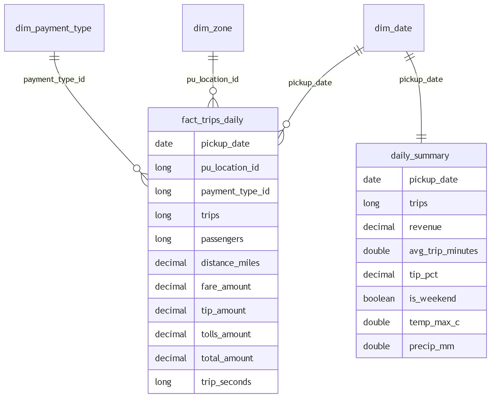

**Catalog, Governance, & Lineage:**
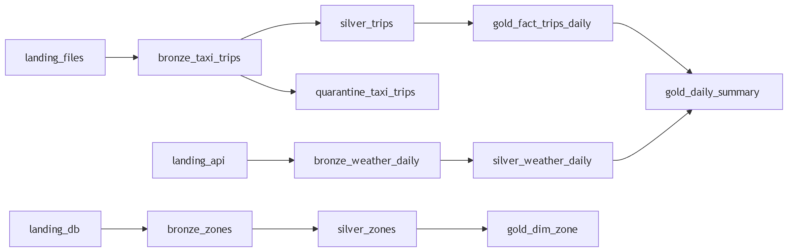

---

### 2. Pipeline Execution

The ELT pipeline successfully ingests reference data, Open-Meteo API weather, and NYC TLC Parquet files, moving them
deterministically through all Medallion layers.

**Seeding the Reference Database:**
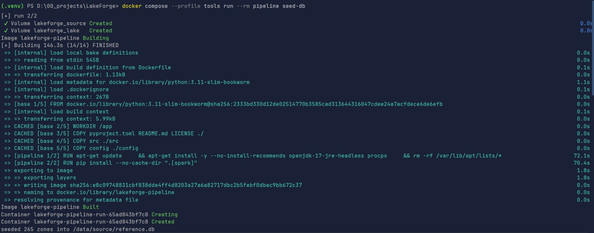

**Pipeline Run Execution:**
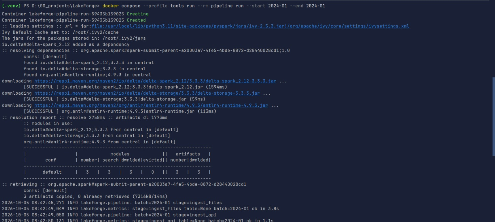
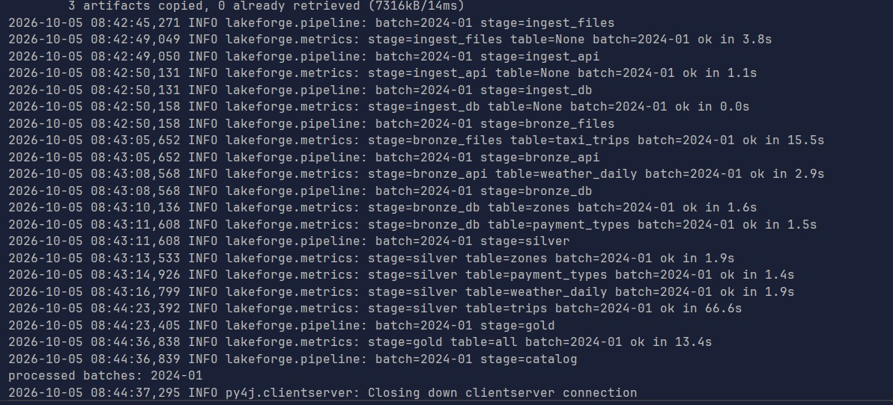

---

### 3. Testing & Coverage

A rigorous test suite guarantees pipeline invariants, including schema validation, quarantine recall, and idempotent
deduplication.

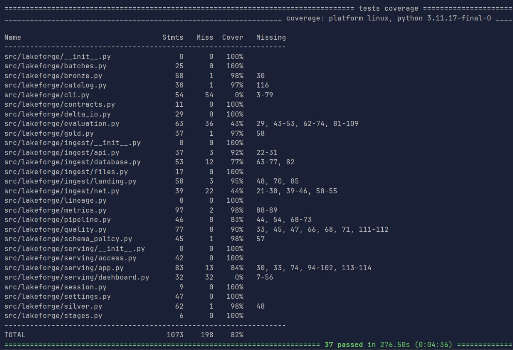

---

### 4. Orchestration (Apache Airflow)

Automated parameterised backfills executed successfully using the production-grade Airflow configuration.

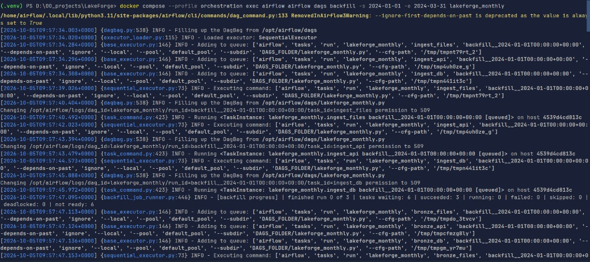

---

### 5. Serving Layer (FastAPI + DuckDB)

The Analytics API exposes Gold tables dynamically based on RBAC policies, allowing secure, read-only SQL queries.

**Swagger UI:**
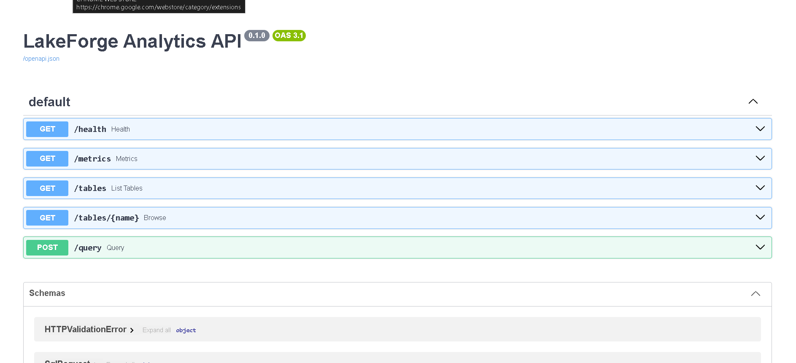

**CLI Query (cURL):**
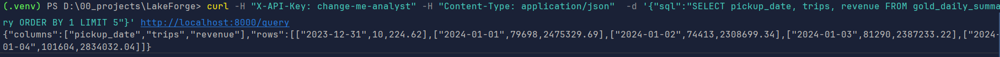

---

### 6. Observability (Prometheus & Grafana)

Custom JSON metrics emitted by the pipeline are scraped by Prometheus and visualized in Grafana to monitor pipeline
SLOs.

**Prometheus Targets:**
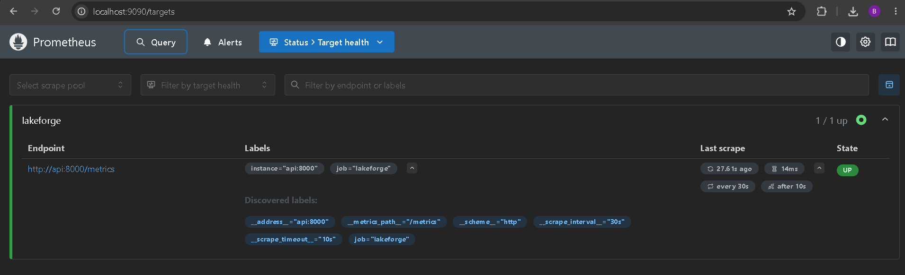

**Grafana Metrics Exploration:**
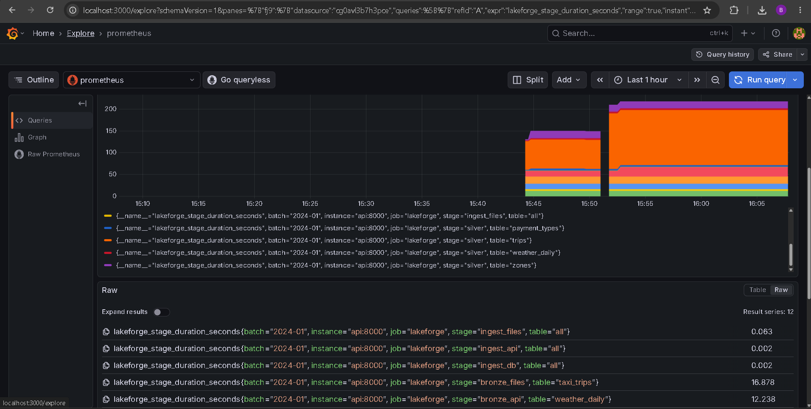

---

### 7. Interactive Analytics (Streamlit)

The Streamlit dashboard seamlessly connects to the Delta Gold tables to visualize revenue, weather impacts, and zone
density.

**Taxi Demand vs Weather:**
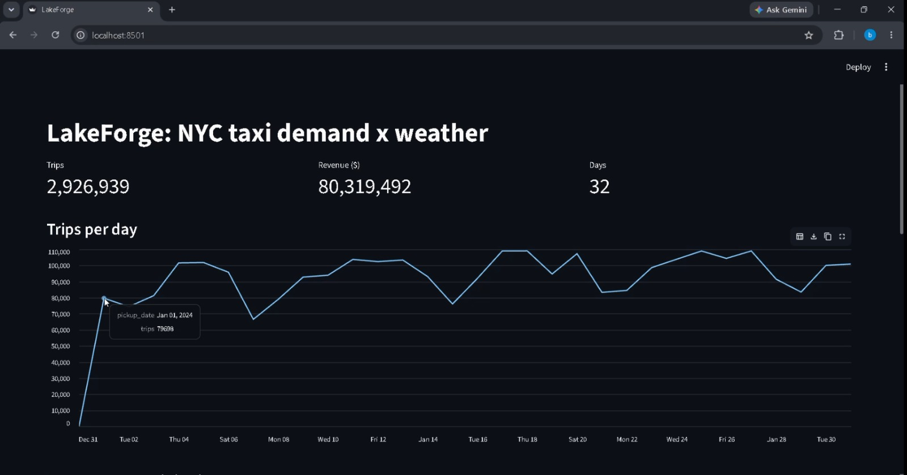
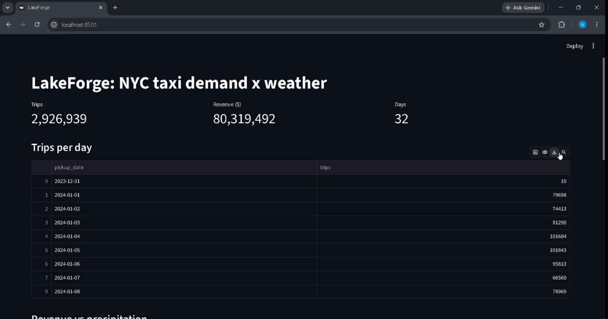

**Revenue vs Precipitation:**

**Top Pickup Zones:**
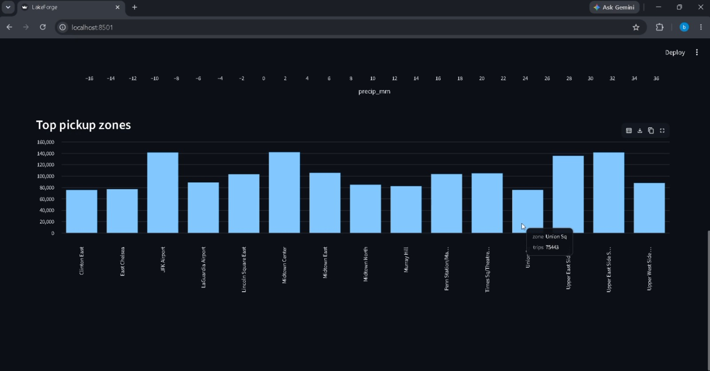
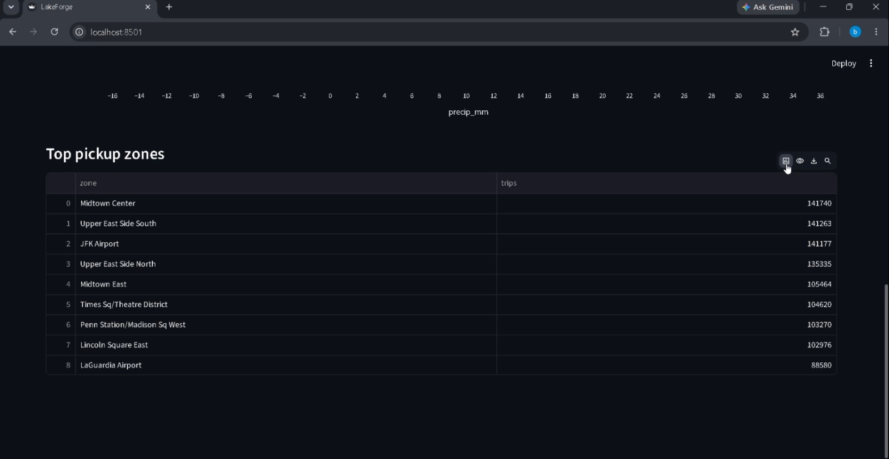

---

## 📜 Changelog Reference

For a granular list of all commits, features, and bug fixes included in this version, please refer to the
automated [CHANGELOG.md](../../CHANGELOG.md) at the root of the repository or visit the GitHub Releases page.

## 🛠️ Migration Guide

*This is the initial major release (v0.1.0). No data migrations from previous versions are required.*

## 🤝 Contributors

- Bibek Dhakal - *Architecture, Data Engineering, & Implementation*
